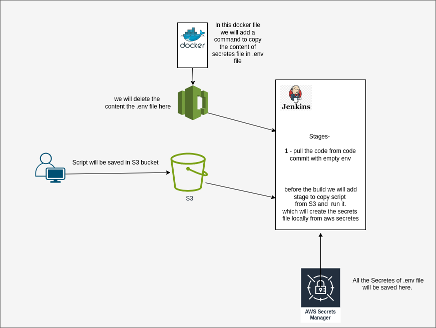

# securing-.env-in-AWS-Secrets




It is not recommended to keep the passwords and secret credentials in the git hub, code commit. etc. it is major securirty concern. so just to overcome that, we can use the AWS service called AWS Secretes to keep them secure.

### This is how to achive it.

Step1 - Create AWS Secretes, add all the keys and values as per mentioned in the env file. & save them.
Step2 - Now we will create a script that will go to the AWS secretes and fetch all the keys and values in the local file. 
Before doing that we will require AWS CLI to be installed in the local machine and aws configure to be done. 

Here is the shell Script that will go to the AWS SECRETES and fetch the secretes in the local mahcine.

```
#!/bin/bash

# AWS Secrets Manager details
SECRET_NAME="your secret name"
AWS_REGION="ap-south-1"

# Local file details
FILE="template.txt"

# Retrieve secret value from AWS Secrets Manager
SECRET_VALUE=$(aws secretsmanager get-secret-value --region $AWS_REGION --secret-id $SECRET_NAME --query SecretString --output text)

# Check if the secret retrieval was successful
if [ $? -eq 0 ]; then
    # Convert JSON format to desired format using AWK and replace ":" with "="
    FORMATTED_SECRET=$(echo "$SECRET_VALUE" | awk -F'[:,}]' -v OFS='=' '{gsub(/[{}"]/,""); gsub(",", "\n"); gsub(/^[ \t]+|[ \t]+$/, ""); gsub(/:/, "="); print}')

    # Replace 'https=' with 'https:'
    FORMATTED_SECRET=$(echo "$FORMATTED_SECRET" | sed 's/https=/https:/g')

    # Write formatted secret values to the local file
    echo "$FORMATTED_SECRET" > "$FILE"
    echo "Secret values successfully written to $FILE"
else
    echo "Failed to retrieve secret values from AWS Secrets Manager"
fi
```


After all this done. We will need to copy this script in the s3 bucket.
